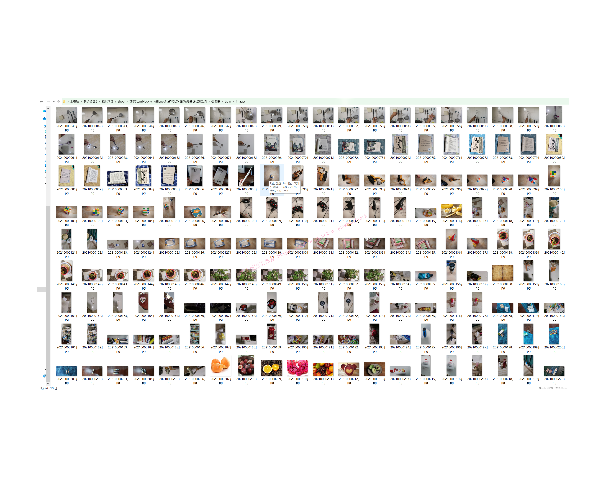
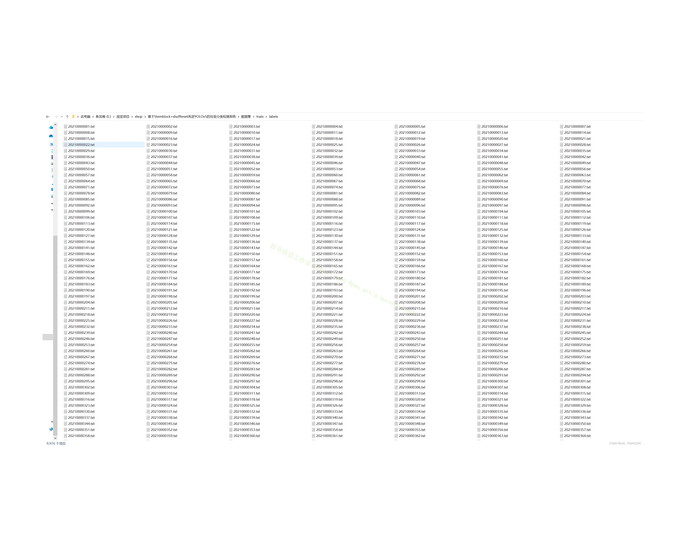
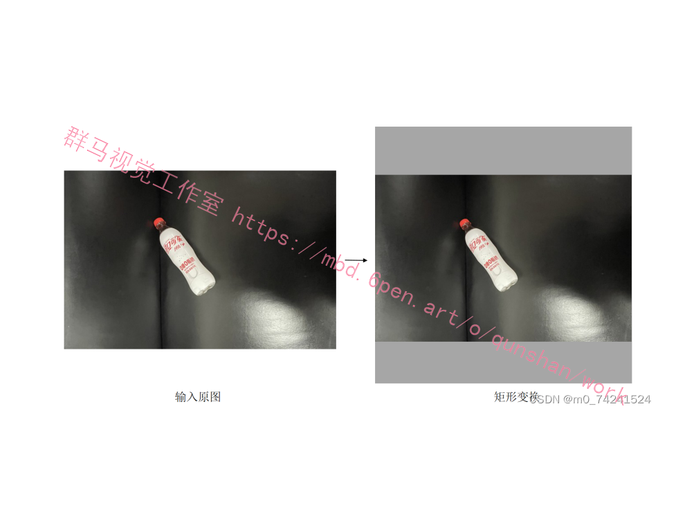
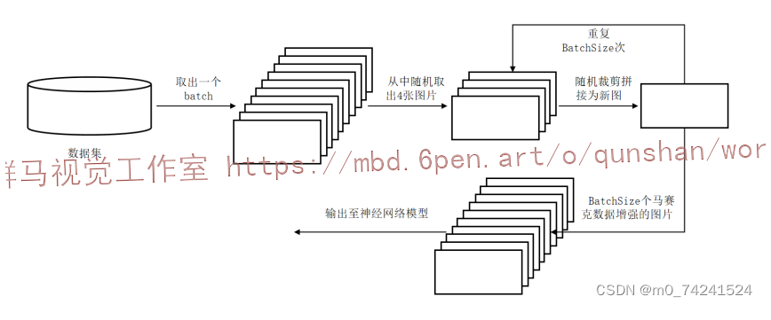
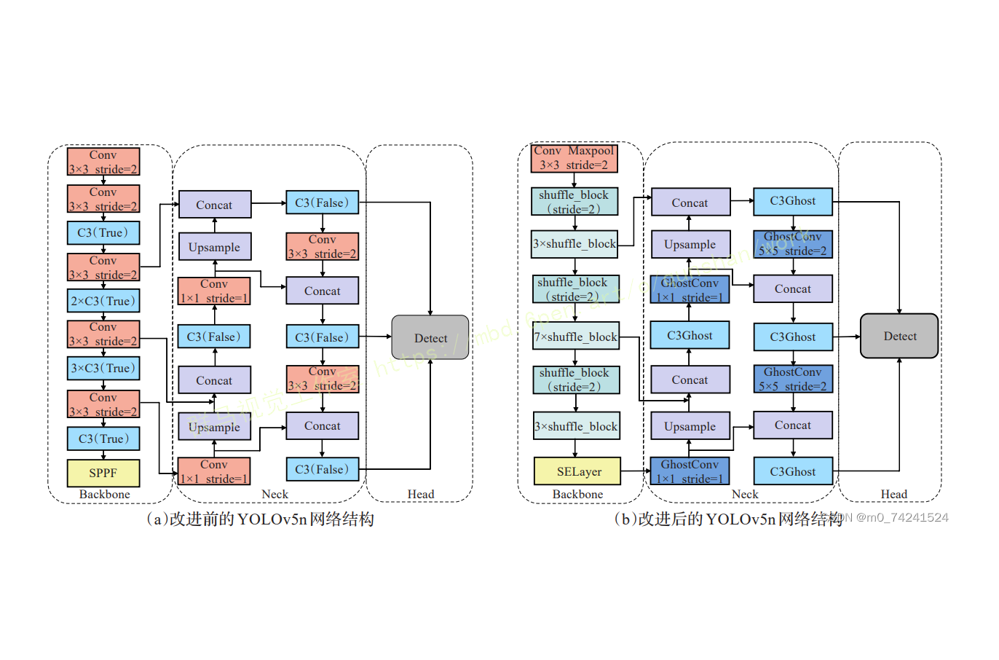
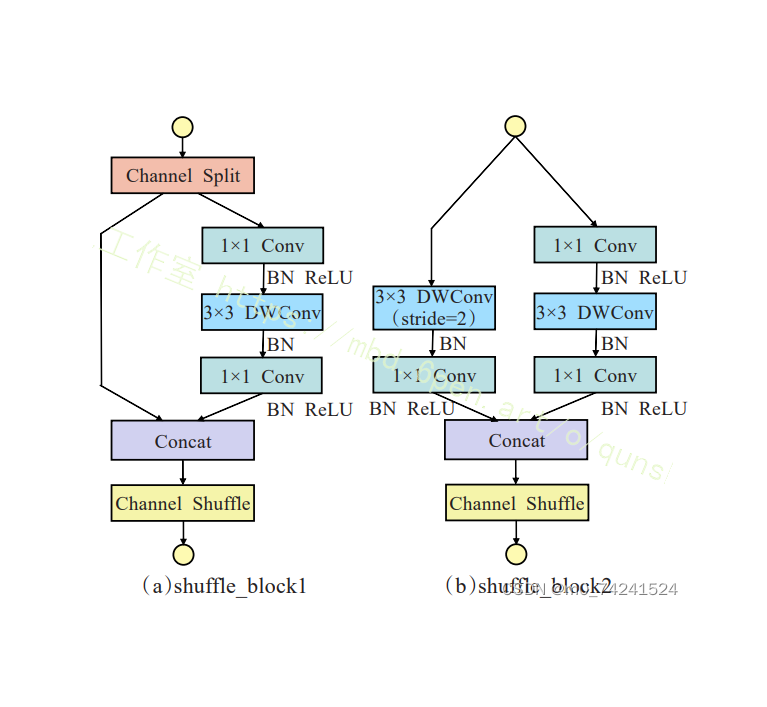
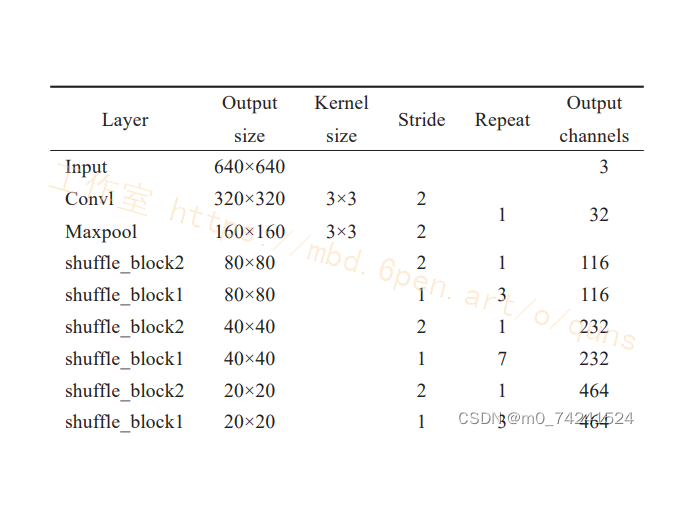

# 基于Stemblock+shufflenet改进YOLOv5的垃圾分类检测系统

# 1.研究背景与意义


垃圾分类是一项重要的环保任务，旨在减少垃圾对环境的污染和资源的浪费。随着城市化进程的加快和人口的增长，垃圾问题日益突出，传统的垃圾分类方式已经无法满足需求。因此，开发一种高效准确的垃圾分类检测系统具有重要的现实意义。

近年来，深度学习技术在计算机视觉领域取得了巨大的突破，特别是目标检测算法的发展。其中，YOLO（You Only Look Once）是一种快速且准确的目标检测算法，已经被广泛应用于各种场景。然而，传统的YOLO算法在垃圾分类任务中存在一些问题，如对小尺寸垃圾的检测效果较差，对于垃圾类别的识别准确率有待提高等。

为了解决这些问题，本研究将基于Stemblock和Shufflenet的改进方法应用于YOLOv5算法，以提高垃圾分类检测系统的性能。Stemblock是一种用于加速卷积神经网络的模块，通过优化网络的初始部分，可以提高网络的特征提取能力和计算效率。Shufflenet是一种轻量级的卷积神经网络结构，可以在保持较高准确率的同时，大幅减少网络的参数量和计算量。

本研究的主要目标是设计一种高效准确的垃圾分类检测系统，以实现自动化的垃圾分类。具体来说，本研究将通过以下几个方面的工作来达到目标：

首先，通过引入Stemblock模块，优化YOLOv5的初始部分，提高网络的特征提取能力和计算效率。Stemblock模块可以有效地减少网络的冗余计算，提高特征图的质量和多样性。

其次，结合Shufflenet的轻量级结构，进一步减少网络的参数量和计算量，提高垃圾分类检测系统的实时性和效率。Shufflenet通过引入逐通道的分组卷积和通道重排操作，可以在保持较高准确率的同时，大幅减少网络的计算复杂度。

最后，通过大量的实验验证和对比分析，评估改进后的YOLOv5算法在垃圾分类任务中的性能表现。本研究将使用公开的垃圾分类数据集进行训练和测试，比较改进后的算法与传统的YOLOv5算法在准确率、召回率和速度等方面的差异。

本研究的意义在于提出了一种基于Stemblock和Shufflenet改进的YOLOv5算法，用于垃圾分类检测系统。该算法具有较高的准确率和实时性，可以有效地应用于实际的垃圾分类场景中。通过自动化的垃圾分类，可以减少人工分类的工作量，提高垃圾分类的效率和准确性，从而为环境保护和资源回收做出贡献。此外，本研究还为深度学习在目标检测领域的应用提供了一种新的思路和方法，对相关研究具有一定的参考价值。


# 2.图片演示


# 3.视频演示
[基于Stemblock+shufflenet改进YOLOv5的垃圾分类检测系统](https://www.bilibili.com/video/BV1dj411a7fM/?spm_id_from=333.999.0.0&vd_source=ff015de2d29cbe2a9cdbfa7064407a08)

# 4.数据集的采集＆标注和整理
#### 图片的收集
首先，我们需要收集所需的图片。这可以通过不同的方式来实现，例如使用现有的数据集、


#### 使用labelImg进行标注
labelImg是一个图形化的图像注释工具，支持VOC和YOLO格式。以下是使用labelImg将图片标注为VOC格式的步骤：

（1）下载并安装labelImg。
（2）打开labelImg并选择“Open Dir”来选择你的图片目录。
（3）为你的目标对象设置标签名称。
（4）在图片上绘制矩形框，选择对应的标签。
（5）保存标注信息，这将在图片目录下生成一个与图片同名的XML文件。
（6）重复此过程，直到所有的图片都标注完毕。


#### 转换为YOLO格式
由于YOLO使用的是txt格式的标注，我们需要将VOC格式转换为YOLO格式。可以使用各种转换工具或脚本来实现。

下面是一个简单的方法是使用Python脚本，该脚本读取XML文件，然后将其转换为YOLO所需的txt格式。
```python
#!/usr/bin/env python3
# -*- coding: utf-8 -*-

import xml.etree.ElementTree as ET
import os

classes = []  # 初始化为空列表

CURRENT_DIR = os.path.dirname(os.path.abspath(__file__))

def convert(size, box):
    dw = 1. / size[0]
    dh = 1. / size[1]
    x = (box[0] + box[1]) / 2.0
    y = (box[2] + box[3]) / 2.0
    w = box[1] - box[0]
    h = box[3] - box[2]
    x = x * dw
    w = w * dw
    y = y * dh
    h = h * dh
    return (x, y, w, h)

def convert_annotation(image_id):
    in_file = open('./label_xml\%s.xml' % (image_id), encoding='UTF-8')
    out_file = open('./label_txt\%s.txt' % (image_id), 'w')  # 生成txt格式文件
    tree = ET.parse(in_file)
    root = tree.getroot()
    size = root.find('size')
    w = int(size.find('width').text)
    h = int(size.find('height').text)

    for obj in root.iter('object'):
        cls = obj.find('name').text
        if cls not in classes:
            classes.append(cls)  # 如果类别不存在，添加到classes列表中
        cls_id = classes.index(cls)
        xmlbox = obj.find('bndbox')
        b = (float(xmlbox.find('xmin').text), float(xmlbox.find('xmax').text), float(xmlbox.find('ymin').text),
             float(xmlbox.find('ymax').text))
        bb = convert((w, h), b)
        out_file.write(str(cls_id) + " " + " ".join([str(a) for a in bb]) + '\n')

xml_path = os.path.join(CURRENT_DIR, './label_xml/')

# xml list
img_xmls = os.listdir(xml_path)
for img_xml in img_xmls:
    label_name = img_xml.split('.')[0]
    print(label_name)
    convert_annotation(label_name)

print("Classes:")  # 打印最终的classes列表
print(classes)  # 打印最终的classes列表

```

#### 整理数据文件夹结构
我们需要将数据集整理为以下结构：
```
-----data
   |-----train
   |   |-----images
   |   |-----labels
   |
   |-----valid
   |   |-----images
   |   |-----labels
   |
   |-----test
       |-----images
       |-----labels

```
确保以下几点：

所有的训练图片都位于data/train/images目录下，相应的标注文件位于data/train/labels目录下。
所有的验证图片都位于data/valid/images目录下，相应的标注文件位于data/valid/labels目录下。
所有的测试图片都位于data/test/images目录下，相应的标注文件位于data/test/labels目录下。
这样的结构使得数据的管理和模型的训练、验证和测试变得非常方便。

# 5.核心代码讲解

#### 5.1 common.py

```python


class CRM(nn.Module):
    def __init__(self, c1, c2, k=3, s=2):
        super(CRM, self).__init__()
        self.conv1 = nn.Sequential(
            nn.Conv2d(c1, c2, k, s, padding=1, bias=False),
            nn.BatchNorm2d(c2),
            nn.ReLU(inplace=True),
        )
        self.mp = nn.MaxPool2d(kernel_size=3, stride=2, padding=1)

    def forward(self, x):
        res = self.mp(self.conv1(x))
        return res

def channel_shuffle(x, groups):
    batch_size, num_channels, height, width = x.data.size()
    channels_per_group = num_channels // groups

    x = x.view(batch_size, groups, channels_per_group, height, width)

    x = x.permute(0, 2, 1, 3, 4).contiguous()

    x = x.view(batch_size, -1, height, width)

    return x

class InvertedResidual(nn.Module):
    def __init__(self, inp, oup, stride):
        super(InvertedResidual, self).__init__()
        self.stride = stride
        assert stride in [1, 2]

        hidden_dim = inp // 2
        self.use_res_connect = self.stride == 1 and inp == oup

        layers = []
        if self.stride == 2:
            layers.append(nn.Conv2d(inp, inp, 3, stride, 1, groups=inp, bias=False))
            layers.append(nn.BatchNorm2d(inp))
            layers.append(nn.ReLU(inplace=True))

        layers.extend([
            nn.Conv2d(hidden_dim, hidden_dim, 1, 1, 0, bias=False),
            nn.BatchNorm2d(hidden_dim),
            nn.ReLU(inplace=True),
            nn.Conv2d(hidden_dim, hidden_dim, 3, stride, 1, groups=hidden_dim, bias=False),
            nn.BatchNorm2d(hidden_dim),
            nn.ReLU(inplace=True),
            nn.Conv2d(hidden_dim, oup, 1, 1, 0, bias=False),
            nn.BatchNorm2d(oup),
        ])

        self.layers = nn.Sequential(*layers)

    def forward(self, x):
        if self.use_res_connect:
            return x + self.layers(x)
        else:
            return self.layers(x)
```

该程序文件名为common.py，包含了两个类和一个函数。

第一个类是CRM，继承自nn.Module，表示一个Conv+ReLU+MaxPool的模块。该类的构造函数接受输入通道数c1、输出通道数c2、卷积核大小k和步长s作为参数。在构造函数中，首先定义了一个包含卷积层、批归一化层和ReLU激活函数的序列，然后定义了一个最大池化层。forward函数中，将输入x经过conv1和mp层的处理后返回结果。

第二个函数是channel_shuffle，用于打乱输入张量x的通道。该函数接受输入张量x和分组数groups作为参数。在函数中，首先获取输入张量的维度信息，然后对输入张量进行reshape操作，将通道维度分为groups组，然后进行转置操作，将通道维度放在第二个维度上，最后进行flatten操作，将张量恢复为原来的形状并返回。

第三个类是InvertedResidual，继承自nn.Module，表示一个ShuffleBlock模块。该类的构造函数接受输入通道数inp、输出通道数oup和步长stride作为参数。在构造函数中，首先判断步长是否为1且输入通道数等于输出通道数，如果是则设置use_res_connect为True，表示使用残差连接。然后根据步长的不同，定义了不同的层序列。如果步长为2，则先进行一个卷积层、批归一化层和ReLU激活函数的处理，然后进行下采样。接着定义了一系列卷积层、批归一化层和ReLU激活函数，最后输出结果。forward函数中，根据use_res_connect的值，决定是否使用残差连接，返回处理后的结果。

#### 5.2 shufflenet.py

```python


def channel_shuffle(x, groups):
    batchsize, num_channels, height, width = x.data.size()
    channels_per_group = num_channels // groups

    # reshape
    x = x.view(batchsize, groups,
               channels_per_group, height, width)

    x = torch.transpose(x, 1, 2).contiguous()

    # flatten
    x = x.view(batchsize, -1, height, width)

    return x


class InvertedResidual(nn.Module):
    def __init__(self, inp, oup, stride):
        super(InvertedResidual, self).__init__()

        if not (1 <= stride <= 3):
            raise ValueError('illegal stride value')
        self.stride = stride

        branch_features = oup // 2
        assert (self.stride != 1) or (inp == branch_features << 1)

        if self.stride > 1:
            self.branch1 = nn.Sequential(
                self.depthwise_conv(inp, inp, kernel_size=3, stride=self.stride, padding=1),
                nn.BatchNorm2d(inp),
                nn.Conv2d(inp, branch_features, kernel_size=1, stride=1, padding=0, bias=False),
                nn.BatchNorm2d(branch_features),
                nn.ReLU(inplace=True),
            )

        self.branch2 = nn.Sequential(
            nn.Conv2d(inp if (self.stride > 1) else branch_features,
                      branch_features, kernel_size=1, stride=1, padding=0, bias=False),
            nn.BatchNorm2d(branch_features),
            nn.ReLU(inplace=True),
            self.depthwise_conv(branch_features, branch_features, kernel_size=3, stride=self.stride, padding=1),
            nn.BatchNorm2d(branch_features),
            nn.Conv2d(branch_features, branch_features, kernel_size=1, stride=1, padding=0, bias=False),
            nn.BatchNorm2d(branch_features),
            nn.ReLU(inplace=True),
        )

    @staticmethod
    def depthwise_conv(i, o, kernel_size, stride=1, padding=0, bias=False):
        return nn.Conv2d(i, o, kernel_size, stride, padding, bias=bias, groups=i)

    def forward(self, x):
        if self.stride == 1:
            x1, x2 = x.chunk(2, dim=1)
            out = torch.cat((x1, self.branch2(x2)), dim=1)
        else:
            out = torch.cat((self.branch1(x), self.branch2(x)), dim=1)

        out = channel_shuffle(out, 2)

        return out


class ShuffleNetV2(nn.Module):
    def __init__(self, stages_repeats, stages_out_channels, num_classes=1000):
        super(ShuffleNetV2, self).__init__()

        if len(stages_repeats) != 3:
            raise ValueError('expected stages_repeats as list of 3 positive ints')
        if len(stages_out_channels) != 5:
            raise ValueError('expected stages_out_channels as list of 5 positive ints')
        self._stage_out_channels = stages_out_channels

        input_channels = 3
        output_channels = self._stage_out_channels[0]
        self.conv1 = nn.Sequential(
            nn.Conv2d(input_channels, output_channels, 3, 2, 1, bias=False),
            nn.BatchNorm2d(output_channels),
            nn.ReLU(inplace=True),
        )
        input_channels = output_channels

        self.maxpool = nn.MaxPool2d(kernel_size=3, stride=2, padding=1)

        stage_names = ['stage{}'.format(i) for i in [2, 3, 4]]
        for name, repeats, output_channels in zip(
                stage_names, stages_repeats, self._stage_out_channels[1:]):
            seq = [InvertedResidual(input_channels, output_channels, 2)]
            for i in range(repeats - 1):
                seq.append(InvertedResidual(output_channels, output_channels, 1))
            setattr(self, name, nn.Sequential(*seq))
            input_channels = output_channels

        output_channels = self._stage_out_channels[-1]
        self.conv5 = nn.Sequential(
            nn.Conv2d(input_channels, output_channels, 1, 1, 0, bias=False),
            nn.BatchNorm2d(output_channels),
            nn.ReLU(inplace=True),
        )

        self.fc = nn.Linear(output_channels, num_classes)

    def forward(self, x):
        x = self.conv1(x)
        x = self.maxpool(x)
        x = self.stage2(x)
        x = self.stage3(x)
        x = self.stage4(x)
        x = self.conv5(x)
        x = x.mean([2, 3])  # globalpool
        x = self.fc(x)
        return x
```

这个程序文件是一个实现了ShuffleNetV2模型的PyTorch代码。ShuffleNetV2是一种高效的卷积神经网络架构，用于图像分类任务。该文件定义了ShuffleNetV2模型的网络结构和相关函数。

该文件中定义了以下类和函数：

- `channel_shuffle(x, groups)`：对输入的特征图进行通道混洗操作。
- `InvertedResidual`：定义了ShuffleNetV2中的倒残差模块。
- `ShuffleNetV2`：定义了整个ShuffleNetV2模型的网络结构。
- `_shufflenetv2(arch, pretrained, progress, *args, **kwargs)`：根据指定的参数构建ShuffleNetV2模型。
- `shufflenet_v2_x0_5(pretrained=False, progress=True, **kwargs)`：构建输出通道为0.5倍的ShuffleNetV2模型。
- `shufflenet_v2_x1_0(pretrained=False, progress=True, **kwargs)`：构建输出通道为1倍的ShuffleNetV2模型。
- `shufflenet_v2_x1_5(pretrained=False, progress=True, **kwargs)`：构建输出通道为1.5倍的ShuffleNetV2模型。
- `shufflenet_v2_x2_0(pretrained=False, progress=True, **kwargs)`：构建输出通道为2倍的ShuffleNetV2模型。

该文件还定义了用于加载预训练模型的URL地址，并提供了加载预训练模型的功能。

总之，这个程序文件实现了ShuffleNetV2模型的网络结构和相关函数，并提供了构建不同输出通道倍数的ShuffleNetV2模型的接口。

#### 5.3 StemBlock.py

```python


class StemBlock(nn.Module):
    def __init__(self, c1, c2):
        super(StemBlock, self).__init__()
        self.stem_1 = nn.Conv2d(c1, c2, kernel_size=3, stride=2, padding=1)
        self.stem_2a = nn.Conv2d(c2, c2//2, kernel_size=1, stride=1)
        self.stem_2b = nn.Conv2d(c2//2, c2, kernel_size=3, stride=2, padding=1)
        self.stem_2c = nn.MaxPool2d(kernel_size=2, stride=2, ceil_mode=True)
        self.stem_3 = nn.Conv2d(c2*2, c2, kernel_size=1, stride=1)
        self.activation = nn.ReLU()

    def forward(self, x):
        res1 = self.activation(self.stem_1(x))
        res2_a = self.activation(self.stem_2a(res1))
        res2_b = self.activation(self.stem_2b(res2_a))
        res2_c = self.activation(self.stem_2c(res1))
        cat_res = torch.cat((res2_b, res2_c), dim=1)
        out = self.activation(self.stem_3(cat_res))
        return out
```

这个程序文件名为StemBlock.py，它定义了一个名为StemBlock的类，该类继承自nn.Module。这个类实现了一个名为StemBlock的结构。

StemBlock结构包括以下几个部分：
1. stem_1：一个Conv层，输入通道数为c1，输出通道数为c2，卷积核大小为k，步长为s，填充为p，分组数为g，膨胀率为d，是否使用激活函数为act。
2. stem_2a：一个Conv层，输入通道数为c2，输出通道数为c2//2，卷积核大小为1，步长为1。
3. stem_2b：一个Conv层，输入通道数为c2//2，输出通道数为c2，卷积核大小为3，步长为2。
4. stem_2c：一个最大池化层，池化核大小为2，步长为2，采用向上取整模式。
5. stem_3：一个Conv层，输入通道数为c2*2，输出通道数为c2，卷积核大小为1，步长为1。

在forward函数中，输入x经过stem_1层得到res1，然后res1经过stem_2a层得到res2_a，res2_a经过stem_2b层得到res2_b，res1经过stem_2c层得到res2_c。然后将res2_b和res2_c在通道维度上进行拼接，得到cat_res。最后，cat_res经过stem_3层得到输出out。


# 6.系统整体结构

整体功能和构架概述：
该程序是一个基于Stemblock+ShuffleNet改进的YOLOv5垃圾分类检测系统。它使用了深度学习模型YOLOv5进行目标检测和分类，并通过图形用户界面（GUI）提供了友好的用户交互界面。程序包含了多个模块和文件，用于实现不同的功能，包括模型定义、数据处理、训练和推理等。

下表整理了每个文件的功能：

| 文件路径 | 功能概述 |
| --- | --- |
| common.py | 包含一些常用的模型结构和辅助函数 |
| shufflenet.py | 实现了ShuffleNetV2模型的网络结构 |
| StemBlock.py | 定义了StemBlock结构，用于模型的前处理 |
| ui.py | 实现了图形用户界面（GUI）和与YOLOv5模型相关的函数 |
| models\common.py | 包含了一些常用的模型结构和辅助函数 |
| models\experimental.py | 实现了YOLOv5的一些实验模块和相关函数 |
| models\mobilenet.py | 实现了MobileNetV3模型的网络结构 |
| models\tf.py | 包含了与TensorFlow相关的模型转换函数 |
| models\yolo.py | 实现了YOLOv5模型的网络结构 |
| models\__init__.py | 模型模块的初始化文件 |
| tools\activations.py | 包含了一些激活函数的定义 |
| tools\augmentations.py | 包含了一些数据增强的函数 |
| tools\autoanchor.py | 包含了自动锚框生成的函数 |
| tools\autobatch.py | 包含了自动批处理大小调整的函数 |
| tools\callbacks.py | 包含了一些训练过程中的回调函数 |
| tools\datasets.py | 包含了数据集的加载和处理函数 |
| tools\downloads.py | 包含了模型权重的下载函数 |
| tools\general.py | 包含了一些通用的辅助函数 |
| tools\loss.py | 包含了一些损失函数的定义 |
| tools\metrics.py | 包含了一些评价指标的计算函数 |
| tools\plots.py | 包含了绘制图表的函数 |
| tools\torch_utils.py | 包含了一些与PyTorch相关的辅助函数 |
| tools\__init__.py | 工具模块的初始化文件 |
| tools\aws\resume.py | 包含了AWS上的模型恢复函数 |
| tools\aws\__init__.py | AWS模块的初始化文件 |
| tools\flask_rest_api\example_request.py | 包含了Flask REST API的示例请求函数 |
| tools\flask_rest_api\restapi.py | 包含了Flask REST API的实现 |
| tools\loggers\__init__.py | 日志记录器模块的初始化文件 |
| tools\loggers\wandb\log_dataset.py | 包含了使用WandB记录数据集的函数 |
| tools\loggers\wandb\sweep.py | 包含了使用WandB进行超参数搜索的函数 |
| tools\loggers\wandb\wandb_utils.py | 包含了与WandB相关的辅助函数 |
| tools\loggers\wandb\__init__.py | WandB日志记录器模块的初始化文件 |
| utils\activations.py | 包含了一些激活函数的定义 |
| utils\augmentations.py | 包含了一些数据增强的函数 |
| utils\autoanchor.py | 包含了自动锚框生成的函数 |
| utils\autobatch.py | 包含了自动批处理大小调整的函数 |
| utils\callbacks.py | 包含了一些训练过程中的回调函数 |
| utils\datasets.py | 包含了数据集的加载和处理函数 |
| utils\downloads.py | 包含了模型权重的下载函数 |
| utils\general.py | 包含了一些通用的


# 7.训练过程设置
本研究中采取重新训练的方式，并不加载预训练权重，神经网络模型优化器均选择SGD，学习率为0.01，学习率衰减为0.0005，图像的输入尺寸均被调整为640×640，BatchSize大小设为32,总计训练1000轮至损失函数收敛，损失函数则采用YOLOv5基线网络所设置的默认损失函数。


注意，这里的图像输入尺寸调整采用的是矩形训练模式，通常来说大多数的目标检测的调整图像尺寸的方式是采用了直接等比例的缩放或者裁剪，这样做会导致图像失真，影响目标的原本特征,产成冗余的信息，使得模型的精度下降。而此处在本研究中采用了矩形训练模式，其具体的操作是确定输出图片的长边，以该边为基准使其缩放至能够被32整除的倍数(在本研究中设置为640×640),然后对于短边的剩余部分进行遮罩填充，以此来保证目标的特征信息，极大的减少了冗余特征，具体如图所示。
此外，在本实验中数据增强部分主要利用了马赛克数据增强算法[7]，主要思路为将四张图片尺寸进行调整并合并成为一张图片，在这个过程中同样对目标框进行变换，丰富了物体检测的尺度与背景，同时在优化计算时会一次性计算四张图片，从而使计算结果更加平均且节省了GPU效率，该算法在本研究方案的主要使用流程如图所示。



# 8.改进YOLOv5算法
#### 改进的网络结构
YOLOv5系列的网络结构均由特征提取Backbone 、特征融合Neck以及检测头部Head三部分组成。YOLOv5的网络结构如图(a)所示。整个网络基本由Conv模块和C3模块组成,其中Neck是由特征图金字塔网络(feature pyramid networks,FPN)和路径聚合网络(path aggregationnetwork, PAN)结合实现多尺度特征融合。FPN自顶向下特征金字塔将深层特征图的语义信息传递给浅层,增强了多尺度特征图的语义表达;PAN自底向上特征金字塔将浅层特征图的位置信息传递给深层,增强了多尺度特征图的定位能力;Head用于检测物体的位置和类别。
本节将从三部分详细描述优化YOLOv5n的相关工作。前两部分介绍了轻量网络结构的设计细节;[参考AAAI的方案](https://mbd.pub/o/bread/ZZWcm55t)改进了YOLOv5主干添加Stemblock模块,利用教师模型YOLOv5s指导轻量化后的YOLOv5n提高检测精度。最终优化后的YOLOv5的网络结构如图(b)所示。


#### ShuffleNet轻量化特征提取
[在谷歌大脑的研究结果](https://afdian.net/item/27b625ee78aa11eea7fa5254001e7c00)中, ShuffleNetv2相比其他轻量级网络鲁棒性更强1⒃,因此本文选择ShuffleNetv2作为轻量化YOLOv5n的特征提取结构。ShuffleNetv2将标准卷积替换为参数量和计算量更小的深度可分离卷积,将普通卷积的计算量近乎降低了一个数量级。由于使用深度可分离卷积后缺少通道间的信息交互与整合会影响网络的特征提取能力, ShuffleNetv2使用了更经济的方式，用Channel Shuffle操作在通道之间进行信息交互和整合来解决这个问题。图2为ShuffleNetv2的基本组成模块。


表1展示了改进后的主干网络结构。本文主要将YOLOv5n的主干替换为ShuffleNetv2的特征提取结构，参数量和计算量显著减少。与原始ShuffleNetv2第一次下采样不同之处在于,这里的输出通道数设置为32,而原始模型的第一层输出通道数是24。增加通道数使网络更宽,可以增强特征提取能力。

# 9.系统整合

下图[完整源码＆数据集＆环境部署视频教程＆自定义UI界面](https://s.xiaocichang.com/s/6d9e71)


参考博客[《基于VFNet＆Varifocal-Loss改进YOLOv5的番茄成熟度检测系统》](https://mbd.pub/o/qunshan/work)

# 10.参考文献
---
[1][王迪聪](https://s.wanfangdata.com.cn/paper?q=%E4%BD%9C%E8%80%85:%22%E7%8E%8B%E8%BF%AA%E8%81%AA%22),[白晨帅](https://s.wanfangdata.com.cn/paper?q=%E4%BD%9C%E8%80%85:%22%E7%99%BD%E6%99%A8%E5%B8%85%22),[邬开俊](https://s.wanfangdata.com.cn/paper?q=%E4%BD%9C%E8%80%85:%22%E9%82%AC%E5%BC%80%E4%BF%8A%22).[基于深度学习的视频目标检测综述](https://d.wanfangdata.com.cn/periodical/jsjkxyts202109002)[J].[计算机科学与探索](https://sns.wanfangdata.com.cn/perio/jsjkxyts).2021,(9).DOI:10.3778/j.issn.1673-9418.2103107 .

[2][毕珠洁](https://s.wanfangdata.com.cn/paper?q=%E4%BD%9C%E8%80%85:%22%E6%AF%95%E7%8F%A0%E6%B4%81%22),[胡绿品](https://s.wanfangdata.com.cn/paper?q=%E4%BD%9C%E8%80%85:%22%E8%83%A1%E7%BB%BF%E5%93%81%22),[蒋超](https://s.wanfangdata.com.cn/paper?q=%E4%BD%9C%E8%80%85:%22%E8%92%8B%E8%B6%85%22),等.[上海生活垃圾分类资源化指标探讨](https://d.wanfangdata.com.cn/periodical/hjwsgc202103002)[J].[环境卫生工程](https://sns.wanfangdata.com.cn/perio/hjwsgc).2021,(3).DOI:10.19841/j.cnki.hjwsgc.2021.03.002 .

[3][罗大为](https://s.wanfangdata.com.cn/paper?q=%E4%BD%9C%E8%80%85:%22%E7%BD%97%E5%A4%A7%E4%B8%BA%22),[方建军](https://s.wanfangdata.com.cn/paper?q=%E4%BD%9C%E8%80%85:%22%E6%96%B9%E5%BB%BA%E5%86%9B%22),[刘艳霞](https://s.wanfangdata.com.cn/paper?q=%E4%BD%9C%E8%80%85:%22%E5%88%98%E8%89%B3%E9%9C%9E%22).[基于通道域注意力机制的特征融合方式](https://d.wanfangdata.com.cn/periodical/dbsdxb202103009)[J].[东北师大学报（自然科学版）](https://sns.wanfangdata.com.cn/perio/dbsdxb).2021,(3).DOI:10.16163/j.cnki.22-1123/n.2021.03.009 .

[4][李恒](https://s.wanfangdata.com.cn/paper?q=%E4%BD%9C%E8%80%85:%22%E6%9D%8E%E6%81%92%22).[基于深度学习过拟合现象的分析](https://d.wanfangdata.com.cn/periodical/zgkjxx202014040)[J].[中国科技信息](https://sns.wanfangdata.com.cn/perio/zgkjxx).2020,(14).90-91.DOI:10.3969/j.issn.1001-8972.2020.14.035 .

[5][王海涛](https://s.wanfangdata.com.cn/paper?q=%E4%BD%9C%E8%80%85:%22%E7%8E%8B%E6%B5%B7%E6%B6%9B%22),[王荣耀](https://s.wanfangdata.com.cn/paper?q=%E4%BD%9C%E8%80%85:%22%E7%8E%8B%E8%8D%A3%E8%80%80%22),[王文皞](https://s.wanfangdata.com.cn/paper?q=%E4%BD%9C%E8%80%85:%22%E7%8E%8B%E6%96%87%E7%9A%9E%22),等.[目标跟踪综述](https://d.wanfangdata.com.cn/periodical/jsjzdclykz202004001)[J].[计算机测量与控制](https://sns.wanfangdata.com.cn/perio/jsjzdclykz).2020,(4).DOI:10.16526/j.cnki.11-4762/tp.2020.04.001 .

[6][赵冬娥](https://s.wanfangdata.com.cn/paper?q=%E4%BD%9C%E8%80%85:%22%E8%B5%B5%E5%86%AC%E5%A8%A5%22),[吴瑞](https://s.wanfangdata.com.cn/paper?q=%E4%BD%9C%E8%80%85:%22%E5%90%B4%E7%91%9E%22),[赵宝国](https://s.wanfangdata.com.cn/paper?q=%E4%BD%9C%E8%80%85:%22%E8%B5%B5%E5%AE%9D%E5%9B%BD%22),等.[高光谱成像的垃圾分类识别研究](https://d.wanfangdata.com.cn/periodical/gpxygpfx201903044)[J].[光谱学与光谱分析](https://sns.wanfangdata.com.cn/perio/gpxygpfx).2019,(3).921-926.DOI:10.3964/j.issn.1000-0593(2019)03-0917-06 .

[7][张黎](https://s.wanfangdata.com.cn/paper?q=%E4%BD%9C%E8%80%85:%22%E5%BC%A0%E9%BB%8E%22).[生活垃圾分类的国内外对比与分析](https://d.wanfangdata.com.cn/periodical/hjwsgc201905002)[J].[环境卫生工程](https://sns.wanfangdata.com.cn/perio/hjwsgc).2019,(5).DOI:10.3969/j.issn.1005-8206.2019.05.002 .

[8][周飞燕](https://s.wanfangdata.com.cn/paper?q=%E4%BD%9C%E8%80%85:%22%E5%91%A8%E9%A3%9E%E7%87%95%22),[金林鹏](https://s.wanfangdata.com.cn/paper?q=%E4%BD%9C%E8%80%85:%22%E9%87%91%E6%9E%97%E9%B9%8F%22),[董军](https://s.wanfangdata.com.cn/paper?q=%E4%BD%9C%E8%80%85:%22%E8%91%A3%E5%86%9B%22).[卷积神经网络研究综述](https://d.wanfangdata.com.cn/periodical/jsjxb201706001)[J].[计算机学报](https://sns.wanfangdata.com.cn/perio/jsjxb).2017,(6).DOI:10.11897/SP.J.1016.2017.01229 .

[9][洪池](https://s.wanfangdata.com.cn/paper?q=%E4%BD%9C%E8%80%85:%22%E6%B4%AA%E6%B1%A0%22),[吕永](https://s.wanfangdata.com.cn/paper?q=%E4%BD%9C%E8%80%85:%22%E5%90%95%E6%B0%B8%22).[广州市生活垃圾分类人工分拣成本探讨](https://d.wanfangdata.com.cn/periodical/gdkj201606022)[J].[广东科技](https://sns.wanfangdata.com.cn/perio/gdkj).2016,(6).DOI:10.3969/j.issn.1006-5423.2016.06.022 .

[10][郭施宏](https://s.wanfangdata.com.cn/paper?q=%E4%BD%9C%E8%80%85:%22%E9%83%AD%E6%96%BD%E5%AE%8F%22),[陆健](https://s.wanfangdata.com.cn/paper?q=%E4%BD%9C%E8%80%85:%22%E9%99%86%E5%81%A5%22).城市环境治理共治机制构建——以垃圾分类为例[J].[中国特色社会主义研究](https://sns.wanfangdata.com.cn/perio/zgtsshzyyj).2020,(5).


---
#### 如果您需要更详细的【源码和环境部署教程】，除了通过【系统整合】小节的链接获取之外，还可以通过邮箱以下途径获取:
#### 1.请先在GitHub上为该项目点赞（Star），编辑一封邮件，附上点赞的截图、项目的中文描述概述（About）以及您的用途需求，发送到我们的邮箱
#### sharecode@yeah.net
#### 2.我们收到邮件后会定期根据邮件的接收顺序将【完整源码和环境部署教程】发送到您的邮箱。
#### 【免责声明】本文来源于用户投稿，如果侵犯任何第三方的合法权益，可通过邮箱联系删除。